# Orqent System And Business Logic

This document consolidates the business logic and system logic planned so far for Orqent. It is a reader-facing map of the existing contracts in `docs/PLAN.md`, `docs/planner.md`, `docs/workflow-lifecycle.md`, `docs/action-catalog.md`, `docs/customer-context.md`, `docs/identity-graph.md`, `docs/provider-capabilities.md`, `docs/database-schema.md`, `docs/evals.md`, and `docs/demo-mode.md`.

Orqent v1 coordinates a support-to-sales-to-contract path across Chatwoot, Twenty, and Documenso. The core invariant is that no External Write executes unless it is represented by an immutable approved Proposed Action.

## Operating Model

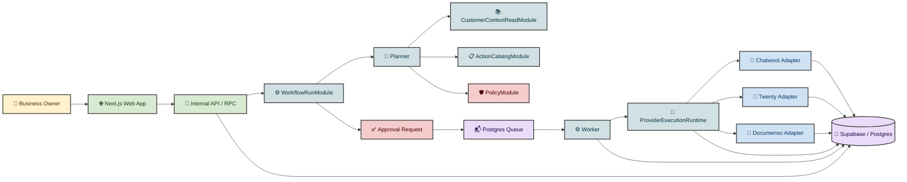

System rules:

- The web app owns UI, internal API/RPC, webhook ingestion, and auth/session handling.
- The worker owns approved write execution, provider calls, retries, reconciliation, and scheduled jobs.
- Business modules use Effect services, Schema types, typed errors, Config, Effect logging, metrics, and span annotations.
- Orqent owns canonical IDs, workflow state, approvals, identity links, snapshots, and audit history.
- Providers remain operational sources of truth for their own records.

## Core Workflow Loop

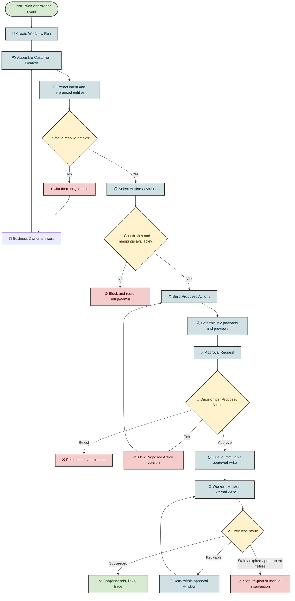

The Planner may use an LLM to classify intent, suggest Business Actions, extract candidate parameters, draft customer-facing text, and explain the proposal. Deterministic code must validate schemas, check capabilities and mappings, enforce policy, create exact provider write payloads, create exact before/after previews, and decide whether approval is required.

## Planner Logic

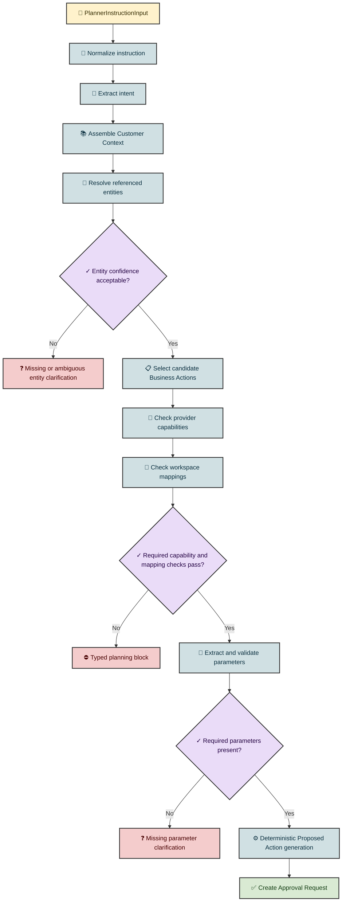

Planner failure modes:

- Ambiguous intent creates a Clarification Question.
- Missing or ambiguous Customer Account, Customer Person, Deal, Contract, signer, template, or support conversation creates clarification unless a provisional shell is safe.
- Missing workspace mapping blocks the affected action and routes to setup/admin.
- Unsupported provider capability blocks the affected action with a fallback suggestion.
- Schema validation failure blocks proposal creation and records a planner validation error.
- Low LLM confidence creates clarification rather than unsafe writes.

## Customer Context Logic

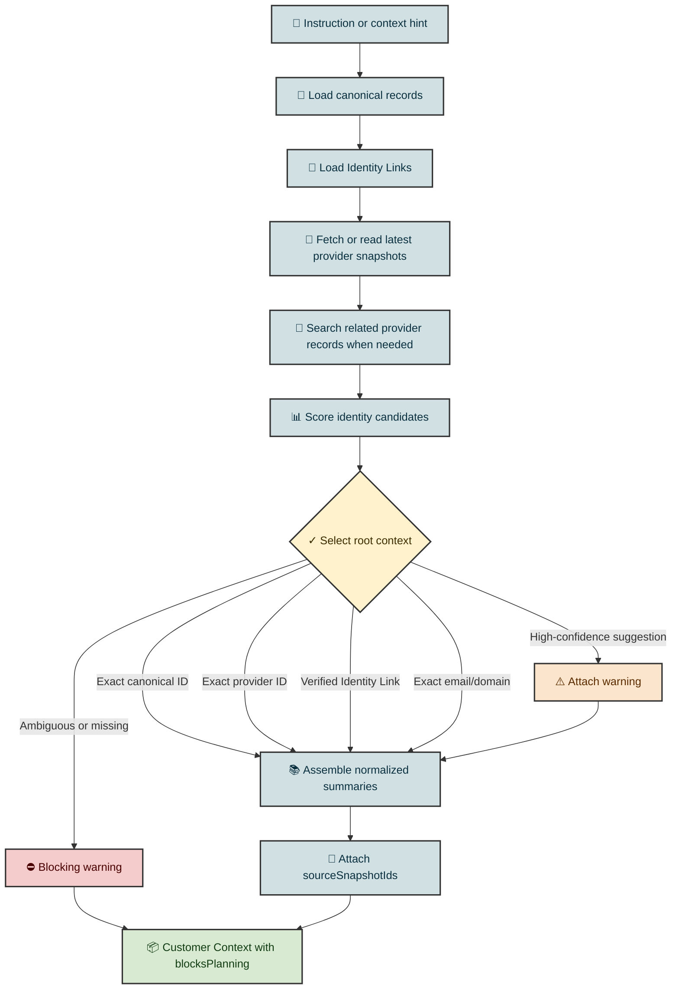

Customer Context contains the evidence the Planner and approval UI need: customer account/person summaries, support history, CRM records, contract/signature state, recent workflow history, identity conflicts, warnings, and source snapshot IDs. Raw provider payloads should not be sent wholesale to the LLM; context must be curated and redacted.

## Identity Graph Logic

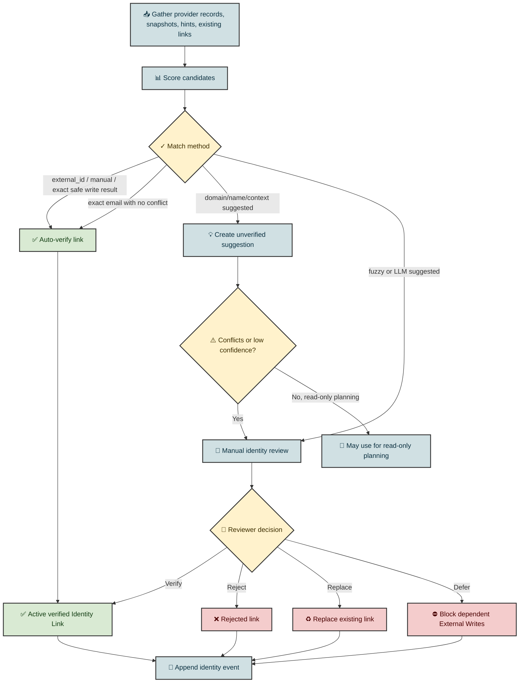

Identity rules:

- Verified links are stronger than confidence scores.
- External Writes that depend on uncertain identity must ask clarification, require manual identity review, or create a provisional shell with explicit approval preview.
- Duplicate detection creates suggestions and review paths; Orqent does not merge provider records automatically in v1.
- Provider external IDs should be written when possible because round-trip IDs are the strongest identity signal.

## Business Action Catalog

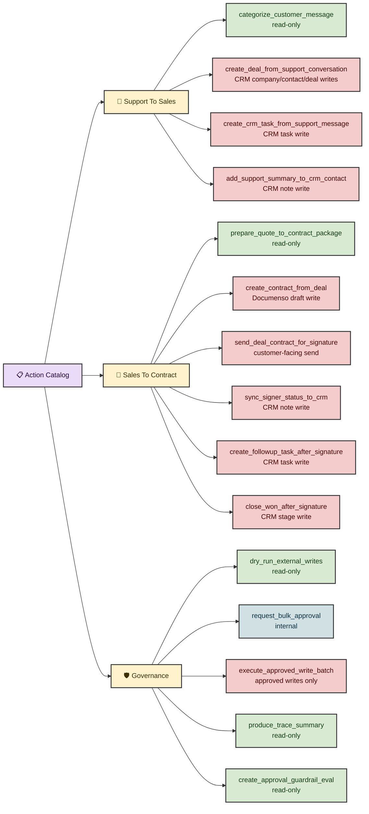

Approval defaults:

- Read-only Business Actions do not require approval.
- Every v1 External Write requires approval.
- Medium-risk writes require Admin/Owner or a permitted Operator.
- High-risk and customer-facing writes require Admin/Owner and exact payload/text preview.
- Bulk approval is UI grouping only; decisions are stored per Proposed Action.

## Provider Capability Logic

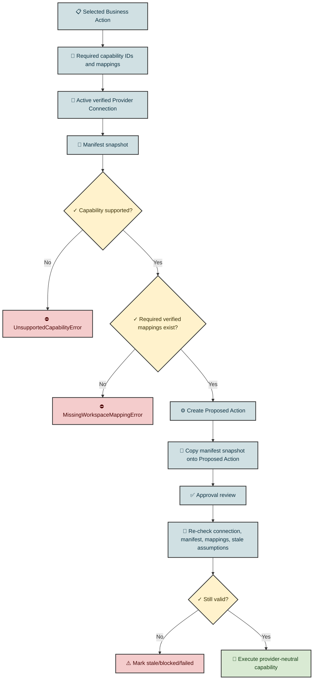

Provider boundaries:

- Business Actions depend on capability IDs, not provider endpoint shapes.
- Twenty implements CRM capabilities.
- Chatwoot implements support capabilities.
- Documenso implements contract capabilities.
- Provider-specific enum mappings, endpoints, quirks, and raw payload handling stay inside adapters.
- Adapter results return normalized output, external refs, and redacted raw payloads.

## Approval And Execution Logic

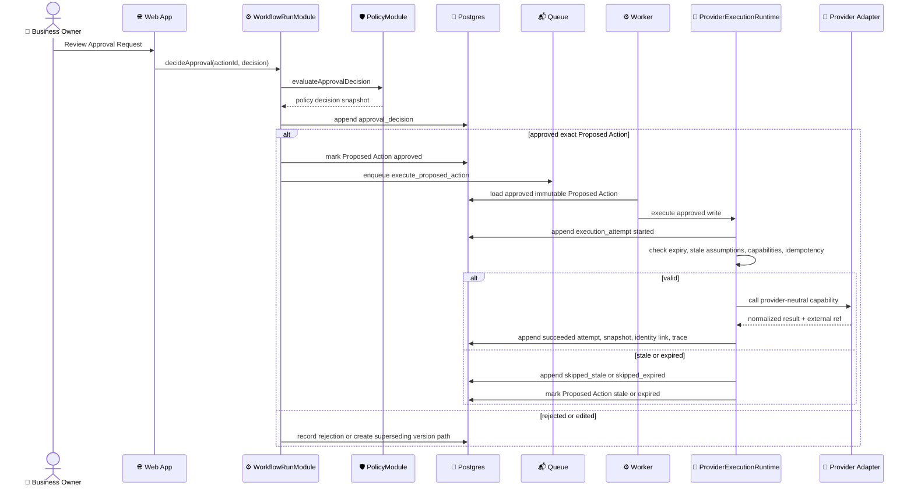

Execution constraints:

- `provider_write_payload` is immutable after approval.
- Edits create a new Proposed Action version and require revalidation/reapproval.
- Retry uses the same immutable payload and same idempotency key.
- Expired actions cannot execute.
- Stale assumptions must be checked immediately before provider calls.
- Execution attempts are append-only.

## Lifecycle State Logic

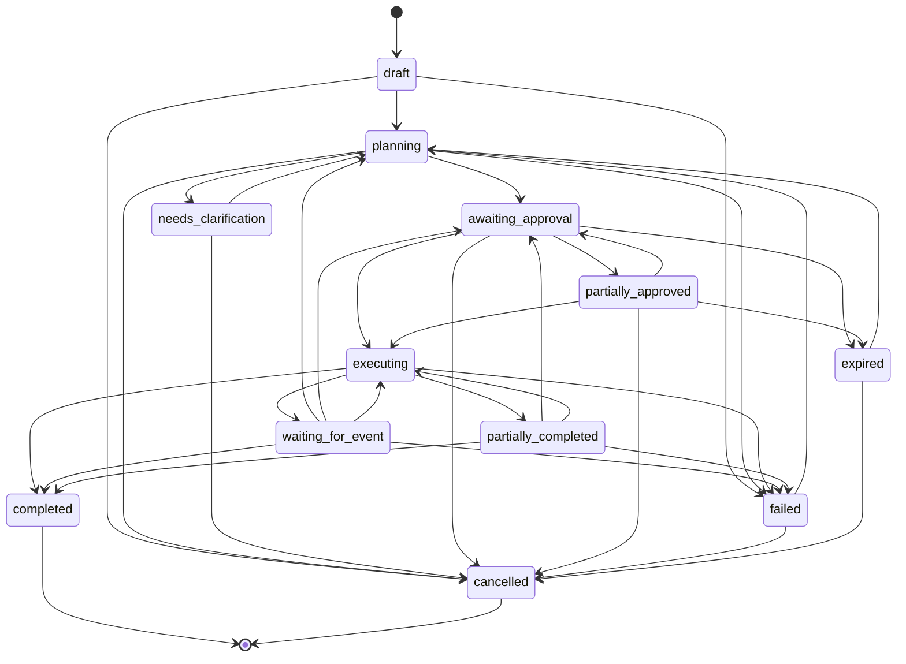

The domain package owns status transition checks for Workflow Runs, Proposed Actions, and Approval Requests. Invalid transitions fail with typed domain errors.

## Provider Event Continuation

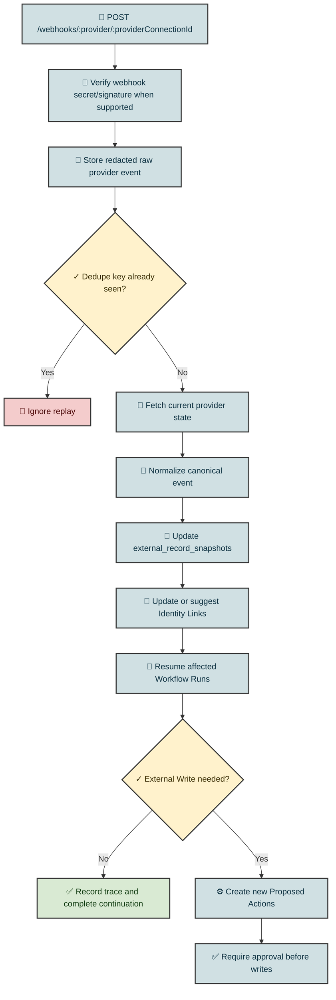

Provider webhooks are facts, not commands. For example, a Documenso completed event verifies current document status, updates the Contract snapshot, emits `contract.completed`, proposes CRM sync and follow-up actions, and still requires approval before CRM writes.

## Persistence And Audit Logic

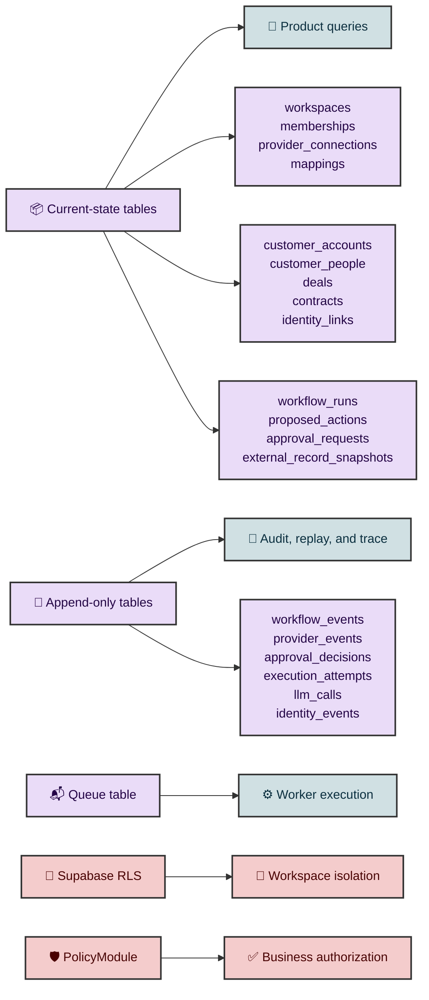

Persistence rules:

- Every tenant-scoped table includes `workspace_id`.
- Current-state tables support product queries.
- Append-only tables preserve auditability and replay.
- Provider-specific payloads live in snapshots/events, not canonical shells.
- Normal frontend roles do not directly mutate workflow execution tables.
- Provider credentials and sensitive raw payloads are service-role-only until explicit redaction views exist.

## Demo Mode Logic

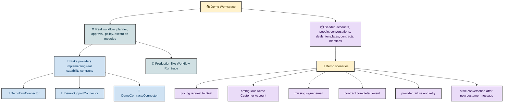

Demo Mode must not become a separate fake app. It uses fake provider adapters behind the same contracts so approval guardrails, workflow trace, retries, stale checks, and provider event continuation behave like production.

## Evaluation Logic

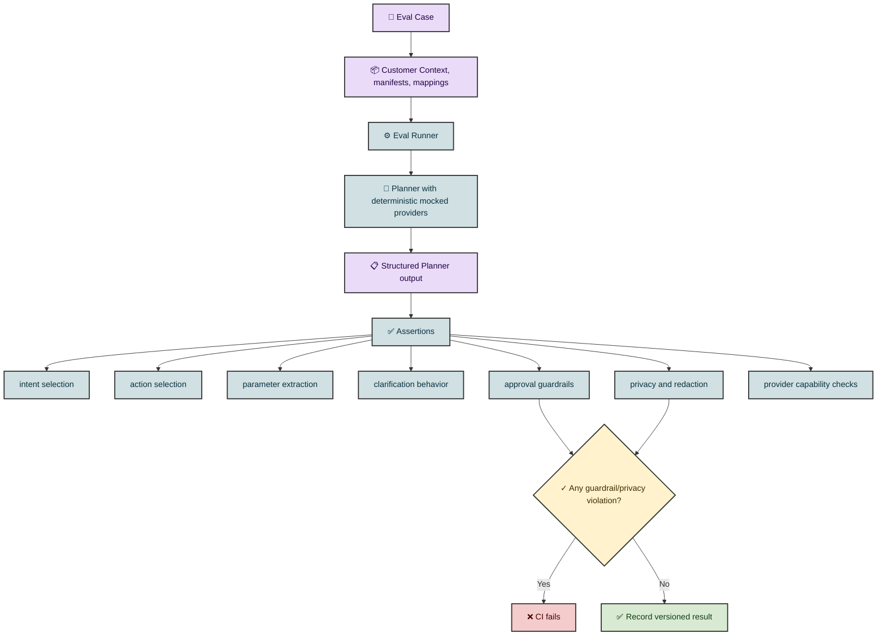

Minimum required golden path evals before private beta:

- Support Conversation to Deal Proposed Actions.
- Approval to Twenty execution.
- Deal to Documenso draft Contract.
- Contract send approval and execution.
- Documenso completed event to CRM sync Proposed Actions.

CI must fail on approval guardrail and privacy violations.

## Source Contract Index

| Logic area | Source contracts |
| --- | --- |
| Product loop and module shape | `docs/PLAN.md`, `CONTEXT.md` |
| Planner pipeline | `docs/planner.md` |
| Workflow, Proposed Action, approval, execution state machines | `docs/workflow-lifecycle.md` |
| Business Actions and capabilities | `docs/action-catalog.md`, `packages/workflows/src/catalog.ts` |
| Customer Context | `docs/customer-context.md` |
| Identity Graph | `docs/identity-graph.md` |
| Provider manifests and adapter boundaries | `docs/provider-capabilities.md`, `packages/provider-runtime/src/capabilities.ts` |
| Persistence, queue, RLS, retention | `docs/database-schema.md`, `packages/db/src/schema.ts` |
| Demo providers and fixtures | `docs/demo-mode.md` |
| Evaluations and quality gates | `docs/evals.md` |
| Durable architecture decisions | `docs/adr/0001-effect-native-core.md` through `docs/adr/0006-single-app-plus-worker.md` |
